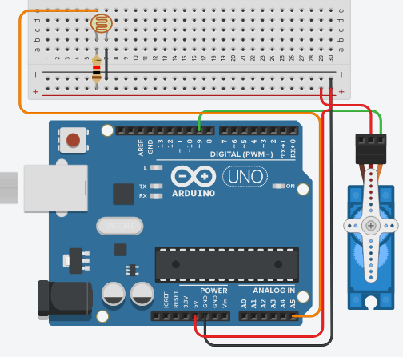

# Objetivo 

## Apresentar conceitos sobre servomotores e controlar um servomotor

* * * * * * *

* Servomotor: Atuador rotacional (ou linear) que permite
controle preciso de angulo (ou posição linear)

* Vem com um motor (geralmente DC), sensor (de posição)
e um controlador (sistema realimentado – malha
fechada)

* Recebe, além da alimentação, um sinal que indica a
posição desejada

* Motor DC, após reduções, movimenta a haste, e a
posição (ângulo) desta é medida por um potenciômetro

* Controlador interno lê potenciômetro e atua no motor
até que a posição desejada seja atingida

## Exercicio 

Faça um “girasol” de uma dimensão utilizando um
servomotor e um sensor de luz acoplado a este. O servo
deve girar de forma que o sensor de luz aponte para o
local com maior luminosidade. Dica: você deve
“amostrar” duas luminosidades em ângulos diferentes,
girar para a posição da maior, e repetir o processo. Faça
melhorias no algoritmo de controle para tornar o
movimento mais suave.

* * * * * * *

